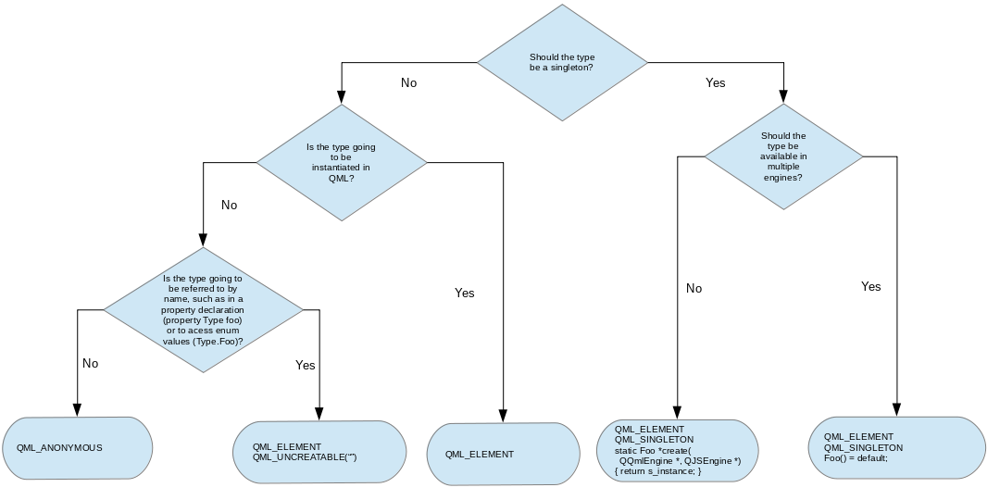

# Overview - QML and C++ Integration

QML is designed to be easily extensible through C++ code. The classes in the Qt QML module enable QML objects to be loaded and manipulated from C++, and the nature of QML engine's integration with Qt's meta object system enables C++ functionality to be invoked directly from QML. This allows the development of hybrid applications which are implemented with a mixture of QML, JavaScript and C++ code.

Integrating QML and C++ provides a variety of opportunities, including the ability to:

 - Separate the user interface code from the application logic code, by implementing the former with QML and JavaScript within QML documents, and the latter with C++
 - Use and invoke some C++ functionality from QML (for example, to invoke your application logic, use a data model implemented in C++, or call some functions in a third-party C++ library)
 - Access functionality in the Qt QML or Qt Quick C++ API (for example, to dynamically generate images using QQuickImageProvider)
 - Implement your own QML object types from C++ — whether for use within your own specific application, or for distribution to others

To provide some C++ data or functionality to QML, it must be made available from a QObject-derived class. Due to the QML engine's integration with the meta object system, the properties, methods and signals of any QObject-derived class are accessible from QML, as described in Exposing Attributes of C++ Types to QML. Once the required functionality is provided by such a class, it can be exposed to QML in a variety of ways:

 - The class can be registered as an instantiable QML type, so that it can be instantiated and used like any ordinary QML object type from QML code
 - The class can be registered as a Singleton Type so that a single instance of the class may be imported from QML code, allowing the instance's properties, methods and signals to be accessed from QML
 - An instance of the class can be embedded into QML code as a context property or context object, allowing the instance's properties, methods and signals to be accessed from QML

These are the most common methods of accessing C++ functionality from QML code; for more options and details, see the main documentation pages that are described in the sections further below. Additionally, aside from the ability to access C++ functionality from QML, the Qt QML module also provides ways to do the reverse and manipulate QML objects from C++ code. See Interacting with QML Objects from C++ for more details.

It is often desirable to expose some state as global properties to QML. Exposing State from C++ to QML describes how to do this.

Finally, the C++ code may be integrated into either a C++ application or a C++ plugin depending on whether it is to be distributed as a standalone application or a library. A plugin can be integrated with a QML module that can then be imported and used by QML code in other applications; see Providing Types and Functionality in a C++ Plugin for more information.

# Choosing the Correct Integration Method Between C++ and QML

To quickly determine which integration method is appropriate for your situation, the following flowchart can be used:

For a description of the macros in the flowchart, see the Defining QML Types from C++ documentation.

# Exposing Attributes of C++ Classes to QML

QML can easily be extended from C++ due to the QML engine's integration with the Qt meta object system. This integration allows the properties, methods and signals of any QObject-derived class to be accessible from QML: properties can be read and modified, methods can be invoked from JavaScript expressions and signal handlers are automatically created for signals as necessary. Additionally, enumeration values of a QObject-derived class are accessible from QML.

See Exposing Attributes of C++ Types to QML for more information.

# Defining QML Types from C++

QML types can be defined in C++ and then registered with the QML type system. This allows a C++ class to be instantiated as a QML object type, enabling custom object types to be implemented in C++ and integrated into existing QML code. A C++ class may be also registered for other purposes: for example, it could be registered as a Singleton Type to enable a single class instance to be imported by QML code, or it could be registered to enable the enumeration values of a non-instantiable class to be accessible from QML.

Additionally, the Qt QML module provides mechanisms to define QML types that integrate with QML concepts like attached properties and default properties.

For more information on registering and creating custom QML types from C++, see the Defining QML Types from C++ documentation.

Embedding C++ Objects into QML with Context Properties
C++ objects and values can be embedded directly into the context (or scope) of loaded QML objects using context properties and context objects. This is achieved through the QQmlContext class provided by the Qt QML module, which exposes data to the context of a QML component, allowing data to be injected from C++ into QML.

See Embedding C++ Objects into QML with Context Properties for more information.

Interacting with QML Objects from C++
QML object types can be instantiated from C++ and inspected in order to access their properties, invoke their methods and receive their signal notifications. This is possible due to the fact that all QML object types are implemented using QObject-derived classes, enabling the QML engine to dynamically load and introspect objects through the Qt meta object system.

Warning: Although it is possible to access QML objects from C++ and manipulate them, it is not the recommended approach, except for testing and prototyping purposes. One of the strengths of QML and C++ integration is the ability to implement UIs in QML separate from the C++ logic and dataset backend, and this fails if the C++ side starts manipulating QML directly. Such an approach also makes changing the QML UI difficult without affecting its C++ counterpart.

For more information on accessing QML objects from C++, see the documentation on Interacting with QML Objects from C++.

Data Type Conversion Between QML and C++
When data values are exchanged between QML and C++, they are converted by the QML engine to have the correct data types as appropriate for use from QML or C++, providing the data types involved are known to the engine.

See Data Type Conversion Between QML and C++ for information on the built-in types supported by the engine and how these types are converted for use when exchanged between QML and C++.
