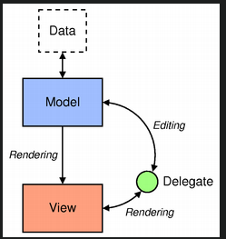

# The model/view architectures

- Model

The model communicates with a source of data, providing an interface for the other components in the architecture. The nature of the communication depends on the type of data source, and the way the model is implemented.

- View

The view obtains model indexes from the model; these are references to items of data. By supplying model indexes to the model, the view can retrieve items of data from the data source.

- Delegate

In standard views, a delegate renders the items of data. When an item is edited, the delegate communicates with the model directly using model indexes.

##  Models, views, and delegates communicate with each other using signals and slots:

- Signals from the model inform the view about changes to the data held by the data source.
- Signals from the view provide information about the user's interaction with the items being displayed.
- Signals from the delegate are used during editing to tell the model and view about the state of the editor.

# Class Diagram

@startuml

Abstract QAbstractItemModel #pink ##[bold]red
Abstract QAbstractItemDelegate #red ##[bold]green
Abstract QAbstractItemView #yellow ##[bold]red
class QModelIndex #green ##[bold]red
class QStandardItem #gray ##[bold]red

QAbstractItemModel <|-- QStandardItemModel 
QAbstractItemModel <|-- QAbstractListModel
QAbstractItemModel <|-- QAbstractProxyModel
QAbstractItemModel <|-- QAbstractTableModel
QAbstractItemModel <|-- QFileSystemModel
QAbstractItemModel <|-- QHelpContentModel
QAbstractItemModel <|-- QPdfBookmarkModel 
QAbstractItemModel <|-- QAbstractItemModelReplica
QAbstractItemModel <|-- QConcatenateTablesProxyModel

remove QAbstractListModel
remove QAbstractProxyModel 
remove QAbstractTableModel
remove QFileSystemModel 
remove QHelpContentModel
remove QPdfBookmarkModel
remove QAbstractItemModelReplica
remove QConcatenateTablesProxyModel

QAbstractItemView <|-- QListView 
QAbstractItemView <|-- QColumnView
QAbstractItemView <|-- QHeaderView
QAbstractItemView <|-- QTableView
QAbstractItemView <|-- QTreeView

remove QHeaderView
remove QColumnView

QAbstractItemDelegate <|-- QItemDelegate
QAbstractItemDelegate <|-- QStyleItemDelegate

QAbstractItemModel -[#red]down->"Rendering" QAbstractItemView
QAbstractItemModel -[#blue]right->"Editing" QAbstractItemDelegate 
QAbstractItemDelegate -[#blue]right->"Editing" QAbstractItemModel 
QAbstractItemDelegate -[#blue]right->"Rendering" QAbstractItemView 
QAbstractItemView -[#blue]right->"Rendering" QAbstractItemDelegate 

@enduml
