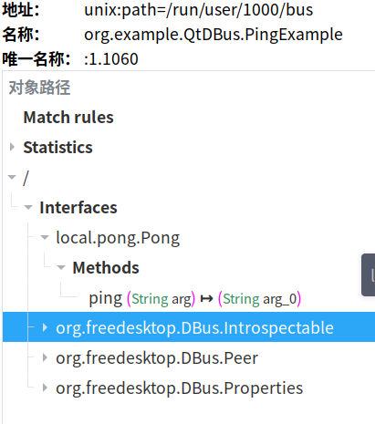
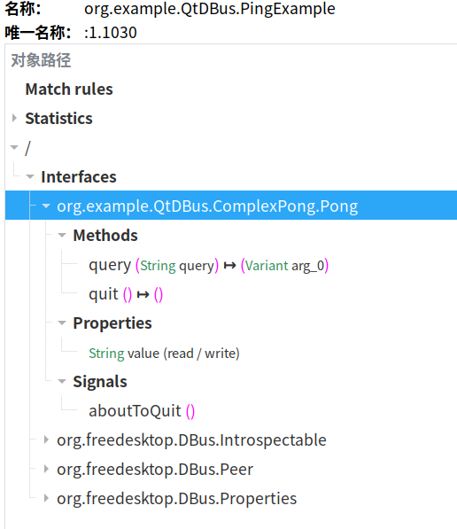

# Qt D-Bus

https://doc.qt.io/qt-6/qtdbus-index.html

# Service

## 简单

接口：

```c
class Pong: public QObject
{
    Q_OBJECT
public slots:
    Q_SCRIPTABLE QString ping(const QString &arg);
};
```

注册服务：

```c
    if (!QDBusConnection::sessionBus().isConnected()) {
        fprintf(stderr, "Cannot connect to the D-Bus session bus.\n"
                "To start it, run:\n"
                "\teval `dbus-launch --auto-syntax`\n");
        return 1;
    }

    if (!QDBusConnection::sessionBus().registerService(SERVICE_NAME)) {
        fprintf(stderr, "%s\n",
                qPrintable(QDBusConnection::sessionBus().lastError().message()));
        exit(1);
    }

    Pong pong;
    QDBusConnection::sessionBus().registerObject("/", &pong, QDBusConnection::ExportAllSlots);

```

d-feet:



## Using Qt D-Bus Adaptors

接口：

```c
class Pong: public QDBusAbstractAdaptor
{
    Q_OBJECT
    Q_CLASSINFO("D-Bus Interface", "org.example.QtDBus.ComplexPong.Pong")
    Q_PROPERTY(QString value READ value WRITE setValue)
public:
    QString m_value;
    QString value() const;
    void setValue(const QString &newValue);

    Pong(QObject *obj) : QDBusAbstractAdaptor(obj)
    { }
signals:
    void aboutToQuit();
public slots:
    QDBusVariant query(const QString &query);
    Q_NOREPLY void quit();
};
```

可以通过Qt D-Bus XML compiler(qdbusxml2cpp)将xml生成 adaptor 类, 工程文件（cmake）添加：

```c
qt5_add_dbus_adaptor(DCONFIG_DBUS_XML ../dde-dconfig-daemon/services/org.desktopspec.ConfigManager.xml
    dconfigserver.h DSGConfigServer
    configmanager_adaptor DSGConfigAdaptor)
```

dconfigserver.h 是Adaptor的parent的header, DSGConfigServer是parent类名

configmanager_adaptor 是Adaptor的文件名，DSGConfigAdaptor是Adaptor的类名


注册服务：

```c

    QObject obj; // Adaptor's parent
    Pong *pong = new Pong(&obj);

    // register object
    QDBusConnection::sessionBus().registerObject("/", &obj);

    // register service
    if (!QDBusConnection::sessionBus().registerService(SERVICE_NAME)) {
        fprintf(stderr, "%s\n",
                qPrintable(QDBusConnection::sessionBus().lastError().message()));
        exit(1);
    }

```

d-feet:



# Client

## method 1

```c
    // find our remote
    QDBusInterface *iface = new QDBusInterface(SERVICE_NAME, "/", "org.example.QtDBus.ComplexPong.Pong",
                               QDBusConnection::sessionBus(), this);
    if (!iface->isValid()) {
        fprintf(stderr, "%s\n",
                qPrintable(QDBusConnection::sessionBus().lastError().message()));
        QCoreApplication::instance()->quit();
    }

    // connect signals
    connect(iface, SIGNAL(aboutToQuit()), QCoreApplication::instance(), SLOT(quit()));
    QDBusConnection::sessionBus().connect(AMServiceName, path, "org.freedesktop.DBus.Properties",
                                          "PropertiesChanged", "sa{sv}as", this,
                                          SLOT(onPropertiesChanged(const QDBusMessage&)));

    // call methods
    iface->call("quit");
    QDBusReply<QDBusVariant> reply = iface->call("query", line);
    if (reply.isValid())
        printf("Reply was: %s\n", qPrintable(reply.value().variant().toString()));
    if (iface->lastError().isValid())
        fprintf(stderr, "Call failed: %s\n", qPrintable(iface->lastError().message()));

    // asyncCall
        // 获取DeviceInfo属性
    QDBusInterface charaManagerInter("org.deepin.dde.Authenticate1",
                             "/org/deepin/dde/Authenticate1/CharaManger",
                             "org.freedesktop.DBus.Properties",
                             QDBusConnection::systemBus());
    QDBusPendingCall call = charaManagerInter.asyncCall("Get", "org.deepin.dde.Authenticate1.CharaManger", "DriverInfo");
    // call.waitForFinished sync
    QDBusPendingCallWatcher *watcher = new QDBusPendingCallWatcher(call, this);
    connect(watcher, &QDBusPendingCallWatcher::finished, [this, call, watcher] {
        if (!call.isError()) {
            QDBusReply<QDBusVariant> reply = call.reply();
            predefineDriverInfo(reply.value().variant().toString());
        } else {
            qWarning() << "Failed to get driver info: " << call.error().message();
        }
        watcher->deleteLater();
    });

    // property
    QVariant reply = iface->property("value");
    if (!reply.isNull())
        printf("value = %s\n", qPrintable(reply.toString()));
    QString line = QString::fromLocal8Bit(qstdin.readLine()).trimmed();
    iface->setProperty("value", line.mid(6));
```

## method 2

```c
    QDBusMessage message = QDBusMessage::createMethodCall("com.Server.Server1",
                                                          "/com/ObjectPath/CTestDbus",
                                                          "com.Interface.CTestDbus",
                                                          "testString");
 
    // 传递参数
    message << QString("lalala");
 
    //发送消息
    QDBusMessage response = QDBusConnection::sessionBus().call(message);
    //判断method是否被正确返回
    if (response.type() == QDBusMessage::ReplyMessage) {
        //从返回参数获取返回值
        QString value = response.arguments().takeFirst().toString();
        qDebug() << QString("Client get return value =  %1").arg(value);
    } else {
        qDebug() << "value method called failed!";
    }
```
