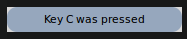
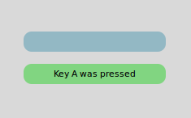
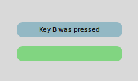
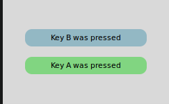
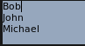

# Keyboard Focus in Qt Quick

When a key is pressed or released, a key event is generated and
delivered to the focused Qt Quick Item. To facilitate the
construction of reusable components and to address some of the cases
unique to fluid user interfaces, the Qt Quick items add a scope based
extension to Qt's traditional keyboard focus model.

## Key Handling Overview

When the user presses or releases a key, the following occurs:

1.  Qt receives the key action and generates a key event.

2.  If a QQuickWindow is the active window, the key event is delivered to it.

3.  The key event is delivered by the scene to the Item with *active focus*.
    If no item has active focus, the key event is ignored.

4.  If the QQuickItem with active focus accepts the key event, propagation stops. Otherwise the event
    is sent to the Item's parent until the event is accepted, or the
    root item is reached.

    If the `Rectangle` type in the following example has active focus and the `A` key is pressed, the event
    will not be propagated further. Upon pressing the `B` key, the event will propagate to the root item
    and thus be ignored.

    ``` js
    Rectangle {
        width: 100; height: 100
        focus: true
        Keys.onPressed: (event)=> {
            if (event.key == Qt.Key_A) {
                console.log('Key A was pressed');
                event.accepted = true;
            }
        }
    }
    ```

5.  If the root Item is reached, the key event is ignored and regular Qt key handling continues.

## Querying the Active Focus Item

Whether or not an Item has active focus can be queried through the `Item::activeFocus` property. For example, here we have
a Text type whose text is determined by whether or not it has active focus.

```js
    Text {
        text: activeFocus ? "I have active focus!" : "I do not have active focus"
    }
```

## Acquiring Focus and Focus Scopes

An Item requests focus by setting the `focus` property to `true`.

For very simple cases simply setting the `focus` property is sometimes sufficient. If we run the following example with
the qml tool, we see that the `keyHandler` type has active focus and pressing the `A`, `B`, or `C` keys modifies the text appropriately.

```js
Rectangle {
    color: "lightsteelblue"; width: 240; height: 25
    Text { id: myText }
    Item {
        id: keyHandler
        focus: true
        Keys.onPressed: (event)=> {
            if (event.key == Qt.Key_A)
                myText.text = 'Key A was pressed'
            else if (event.key == Qt.Key_B)
                myText.text = 'Key B was pressed'
            else if (event.key == Qt.Key_C)
                myText.text = 'Key C was pressed'
        }
    }
}
```



However, were the above example to be used as a reusable or imported
component, this simple use of the `focus` property is no longer sufficient.

To demonstrate, we create two instances of our previously defined
component and set the first one to have focus. The intention is that
when the `A`, `B`, or `C` keys are pressed, the first of the two components
receives the event and responds accordingly.

The code that imports and creates two MyWidget instances:

```js
//Window code that imports MyWidget
Rectangle {
    id: window
    color: "white"; width: 240; height: 150

    Column {
        anchors.centerIn: parent; spacing: 15

        MyWidget {
            focus: true             //set this MyWidget to receive the focus
            color: "lightblue"
        }
        MyWidget {
            color: "palegreen"
        }
    }
}
```

The MyWidget code:

```js
Rectangle {
    id: widget
    color: "lightsteelblue"; width: 175; height: 25; radius: 10; antialiasing: true
    Text { id: label; anchors.centerIn: parent}
    focus: true
    Keys.onPressed: (event)=> {
        if (event.key == Qt.Key_A)
            label.text = 'Key A was pressed'
        else if (event.key == Qt.Key_B)
            label.text = 'Key B was pressed'
        else if (event.key == Qt.Key_C)
            label.text = 'Key C was pressed'
    }
}
```

We want the first `MyWidget` object to have the focus, so we set its `focus` property to
`true`. However, by running the code, we can confirm that the second widget receives the focus.



Looking at both `MyWidget` and `window` code, the problem is evident - there
are three types that set the `focus` property to `true`. The two `MyWidget`s
set the `focus` to `true` and the `window` component also sets the focus.
Ultimately, only one type can have keyboard focus, and the system has
to decide which type receives the focus. When the second `MyWidget` is
created, it receives the focus because it is the last type to set its 
`focus` property to `true`.

This problem is due to visibility. The `MyWidget` component would like to have 
the focus, but it cannot control the focus when it is imported or reused. 
Likewise, the `window` component does not have the ability to know if its 
imported components are requesting the focus.

To solve this problem, QML introduces a concept known as a *focus scope*. 
For existing Qt users, a focus scope is like an automatic focus proxy. 
A focus scope is created by declaring the FocusScope type.

In the next example, a FocusScope type is added to the component, and the visual result shown.

```js
FocusScope {

    //FocusScope needs to bind to visual properties of the Rectangle
    property alias color: rectangle.color
    x: rectangle.x; y: rectangle.y
    width: rectangle.width; height: rectangle.height

    Rectangle {
        id: rectangle
        anchors.centerIn: parent
        color: "lightsteelblue"; width: 175; height: 25; radius: 10; antialiasing: true
        Text { id: label; anchors.centerIn: parent }
        focus: true
        Keys.onPressed: (event)=> {
            if (event.key == Qt.Key_A)
                label.text = 'Key A was pressed'
            else if (event.key == Qt.Key_B)
                label.text = 'Key B was pressed'
            else if (event.key == Qt.Key_C)
                label.text = 'Key C was pressed'
        }
    }
}
```



Conceptually *focus scopes* are quite simple.

-   Within each focus scope one object may have `Item::focus` set to `true`. If more
    than one Item has the `focus` property set, the last type to set the `focus`
    will have the focus and the others are unset, similar to when there are no focus scopes.
-   When a focus scope receives active focus, the contained type with `focus` set (if any)
    also gets the active focus. If this type is also a FocusScope, the proxying behavior continues.
    Both the focus scope and the sub-focused item will have the `activeFocus` property set.

Note that, since the FocusScope type is not a visual type, the properties of its children need to be exposed to the
parent item of the FocusScope. Layouts and positioning types will use these visual and styling properties to create
the layout. In our example, the `Column` type cannot display the two widgets properly because the FocusScope lacks visual
properties of its own. The MyWidget component directly binds to the `rectangle` properties to allow the
`Column` type to create the layout containing the children of the FocusScope.

So far, the example has the second component statically selected. It is trivial now to extend this component 
to make it clickable, and add it to the original application. We still set one of the widgets as focused by
default. Now, clicking either MyClickableWidget gives it focus and the other widget loses the focus.

The code that imports and creates two MyClickableWidget instances:

```js
Rectangle {
    id: window

    color: "white"; width: 240; height: 150

    Column {
        anchors.centerIn: parent; spacing: 15

        MyClickableWidget {
            focus: true             //set this MyWidget to receive the focus
            color: "lightblue"
        }
        MyClickableWidget {
            color: "palegreen"
        }
    }

}
```

The MyClickableWidget code:

```js
FocusScope {

    id: scope

    //FocusScope needs to bind to visual properties of the children
    property alias color: rectangle.color
    x: rectangle.x; y: rectangle.y
    width: rectangle.width; height: rectangle.height

    Rectangle {
        id: rectangle
        anchors.centerIn: parent
        color: "lightsteelblue"; width: 175; height: 25; radius: 10; antialiasing: true
        Text { id: label; anchors.centerIn: parent }
        focus: true
        Keys.onPressed: (event)=> {
            if (event.key == Qt.Key_A)
                label.text = 'Key A was pressed'
            else if (event.key == Qt.Key_B)
                label.text = 'Key B was pressed'
            else if (event.key == Qt.Key_C)
                label.text = 'Key C was pressed'
        }
    }
    MouseArea { anchors.fill: parent; onClicked: { scope.focus = true } }
}
```



When a QML Item explicitly relinquishes focus (by setting its `focus` property to
`false` while it has active focus), the system does not automatically select
another type to receive focus. That is, it is possible for there to be no currently active focus.

## Advanced Uses of Focus Scopes

Focus scopes allow focus to allocation to be easily partitioned. Several QML items use it to this effect.

ListView, for example, is itself a focus scope. Generally this isn't noticeable as
ListView doesn't usually have manually added visual children. By being a focus scope,
ListView can focus the current list item without worrying about how that will effect the rest
of the application. This allows the current item delegate to react to key presses.

This contrived example shows how this works. Pressing the `Return` key will print the name of the current list item.

```js
Rectangle {
    color: "lightsteelblue"; width: 100; height: 50

    ListView {
        anchors.fill: parent
        focus: true

        model: ListModel {
            ListElement { name: "Bob" }
            ListElement { name: "John" }
            ListElement { name: "Michael" }
        }

        delegate: FocusScope {
                width: childrenRect.width; height: childrenRect.height
                x:childrenRect.x; y: childrenRect.y
                TextInput {
                    focus: true
                    text: name
                    Keys.onReturnPressed: console.log(name)
                }
        }
    }
}
```



While the example is simple, there is a lot going on behind the scenes. Whenever the current item changes, the
ListView sets the delegate's `Item::focus` property. As the ListView is a focus scope, this doesn't affect the 
rest of the application. However, if the ListView itself has active focus this causes the delegate itself to
receive active focus. In this example, the root type of the delegate is also a focus scope, which in
turn gives active focus to the TextInput type that actually performs the work of handling the `Return` key.

All of the QML view classes, such as PathView and GridView, behave in a similar manner to allow key handling in their respective delegates.
